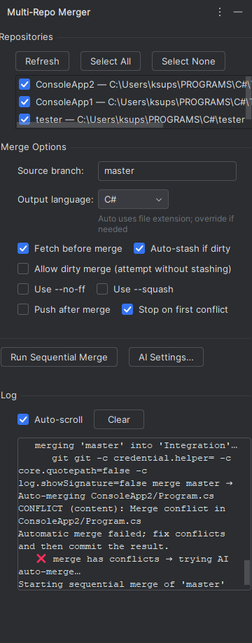
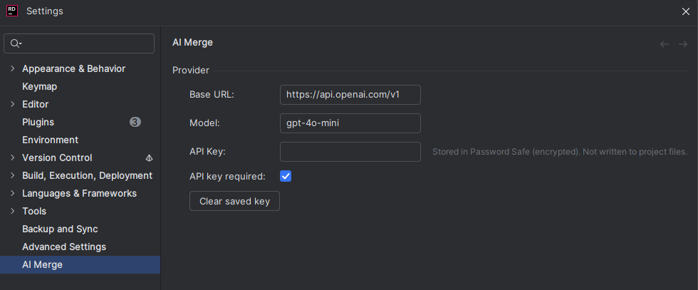

# Multi-Repo Merger (Rider Plugin)

Run the **same Git merge across multiple repositories, sequentially**, right inside Rider.  
Optional **AI auto-merge** kicks in when conflicts happen (OpenAI-compatible).


---

## Features

- Select multiple Git repos and merge a source branch into each, one by one
- Options: fetch, auto-stash, allow dirty merge, `--no-ff`, `--squash`, push, stop on conflict
- **AI auto-merge** (OpenAI-compatible) to resolve conflicts file-by-file
- Opens JetBrains’ **Resolve Conflicts** UI if conflicts remain
- Live log with auto-scroll + clear

---





---

## Requirements

- Rider **2025.2** (build line `252.*`)
- JDK **17**
- Kotlin **2.2.10**
- IntelliJ Platform Gradle Plugin **2.7.2**

---

## Build & Install

**Build a plugin ZIP:**
```bash
./gradlew clean buildPlugin
```
The ZIP is created at: `build/distributions/<plugin-name>-<version>.zip`.

**Install in Rider (other computer or locally):**
- Rider → **Settings → Plugins** → ⚙️ → **Install Plugin from Disk…**
- Pick the ZIP → Restart Rider.

**Dev / debug run:**
```bash
./gradlew runIde
```

---

## Configuration (AI)

The plugin supports any OpenAI-compatible `/v1/chat/completions` API.

Open **Settings → Tools → AI Merge** and configure:

- **Base URL** (e.g. `https://api.openai.com/v1`)
- **Model** (e.g. `gpt-4o-mini`)
- **API Key** — stored securely locally in JetBrains **Password Safe** (not in your project)

---

## Usage

1. Open the **Multi-Repo Merger** tool window (left stripe).  
2. Click **Refresh** to detect repos; select the repos you want.  
3. Enter **Source branch** (e.g. `feature/integration`).  
4. (Optional) Pick **Output language** for AI (“Auto” detects by file extension).  
5. Choose options (fetch, stash, no-ff/squash, push, stop on conflict).  
6. Click **Run Sequential Merge**.

**Flow:**
- Each selected repo is processed in order.
- If repo is dirty and **Auto-stash** is enabled, changes are stashed before merge and restored after.
- On merge conflicts, the plugin tries **AI auto-merge** per conflicted file.
- If conflicts remain, the standard **Resolve Conflicts** dialog opens.
- If enabled, a **push** is performed after a successful merge.

